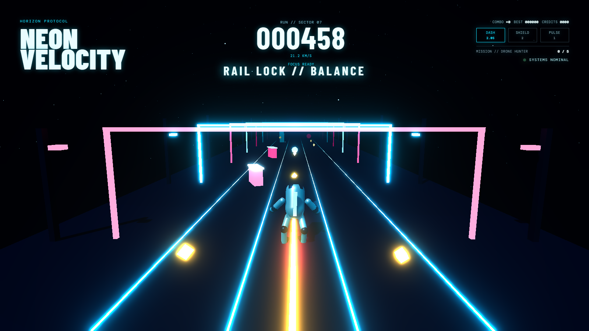

# NEON VELOCITY — Horizon Protocol

A three-lane endless runner built with [Three.js](https://threejs.org) and [Vite](https://vite.dev). Dodge obstacles, chain shard combos, grind rails, and take down the WRAITH-01 interceptor.



Runs entirely in the browser — no backend, no build step for players, no account. Progress (best score, credits, settings) is kept in `localStorage`.

## Who built this

Built by me together with the **Hermes agent** and **GPT 5.6 Terra**, at a total cost of roughly **$20 via [OpenRouter](https://openrouter.ai)** — that covers the game itself: the renderer, the run cycle, the state machine, the boss fight, and the tests.

**Claude** came in afterwards for the scaffolding around it: the run scripts (`run.sh`, `run.ps1`, `scripts/start.mjs`), project metadata (`.gitignore`, `.gitattributes`, license, `engines`), this README, and setting up the git repo and publishing it to GitHub. None of the game logic.

## Requirements

- **Node.js** `^20.19.0` or `>=22.12.0` — the floor Vite 7 sets. [Download](https://nodejs.org)
- A browser with **WebGL 2** — any current Chrome, Edge, Firefox, or Safari.

Nothing else. `npm` ships with Node.

## Quick start

Clone, then run one command. It installs dependencies on first use and starts the dev server at **http://localhost:5173**.

**Linux / macOS**

```sh
git clone https://github.com/mericstam/neon-velocity.git
cd neon-velocity
./run.sh
```

**Windows (PowerShell)**

```powershell
git clone https://github.com/mericstam/neon-velocity.git
cd neon-velocity
.\run.ps1
```

If PowerShell blocks the script, either allow local scripts once with
`Set-ExecutionPolicy -Scope CurrentUser RemoteSigned`, or skip the wrapper
entirely and use `npm start`.

## Commands

Every task works the same way on both platforms. `npm start` is equivalent if you prefer npm directly.

| Task | Linux / macOS | Windows | npm |
| --- | --- | --- | --- |
| Dev server (hot reload) | `./run.sh` | `.\run.ps1` | `npm start` |
| Production build → `dist/` | `./run.sh build` | `.\run.ps1 build` | `npm start build` |
| Preview the built bundle | `./run.sh preview` | `.\run.ps1 preview` | `npm start preview` |
| Run tests | `./run.sh test` | `.\run.ps1 test` | `npm start test` |

The dev server runs on **:5173**; `preview` serves the built `dist/` on **:4173** and requires a `build` first. The underlying scripts — `npm run dev`, `build`, `preview`, `test` — still work on their own if you already have dependencies installed.

### How the runner scripts work

`run.sh` and `run.ps1` are thin wrappers around `scripts/start.mjs`, which holds all the logic so the two platforms can't drift apart. Before running a task it:

1. Checks your Node version against the Vite 7 requirement and fails with a clear message rather than a cryptic error inside a dependency.
2. Installs dependencies **only when needed** — `npm ci` on a fresh clone, `npm install` when `package-lock.json` is newer than your last install, and nothing at all when you're up to date.
3. Runs the requested task.

So `./run.sh` after a `git pull` that changed dependencies will pick them up automatically.

## Controls

| Action | Keys |
| --- | --- |
| Change lane | `←` `→` or `A` `D` |
| Jump | `Space` or `↑` |
| Dash | hold `Shift` or `X` |
| Shield | `E` |
| Pulse | `F` |
| Pause | `Esc` |
| Start run | `Enter` |

On-screen buttons along the bottom mirror all six actions for touch and mouse.

**Dash** drains a 2-second battery only while held, then needs ~2.35s to recharge — tap it for a short burst and you keep the remainder. **Shield** absorbs one impact per charge. **Pulse** destroys drones in your lane, and is the only way to damage the boss while its core is exposed.

Three perfect dodges in a row trigger overdrive; near-misses slow time briefly (focus). Rails lock you to a lane for bonus score until you jump off.

## Project layout

```
index.html              markup + HUD (Vite entry point)
src/main.js             renderer, scene graph, animation loop, input, audio
src/game-state.js       RunnerState — all game rules, no Three.js
src/style.css           styling
test/runner-state.test.js   unit tests for RunnerState
scripts/start.mjs       install + run logic
run.sh / run.ps1        platform entry points
```

The split between the two `src` files is deliberate and worth preserving: **`game-state.js` imports nothing from Three.js.** All scoring, collision, cooldown, shield, boss, and loadout rules live there as a plain class, which is what makes them testable without a browser or a WebGL context. `main.js` owns everything visual and calls into that state each frame.

## Tests

```sh
./run.sh test          # or: npm start test
```

19 [Vitest](https://vitest.dev) tests cover `RunnerState` — collision and lane logic, the dash battery and cooldown, shield charges and the immunity window that stops one impact from spending two charges, combo decay, boss phases, revive, loadouts, and rank thresholds. They run in Node in well under a second; no browser needed.

## Configuration

In-game settings (pause → `SETTINGS`) persist to `localStorage`:

- **Master volume** — the engine drone and all effects.
- **Quality** — `high` / `balanced` / `performance`, adjusting pixel ratio, shadow maps, and bloom strength. Drop to `performance` on integrated graphics.
- **Reduce shake + flash** — disables camera shake for motion sensitivity.

Stored under the keys `neon-velocity-settings`, `neon-velocity-best-score`, and `neon-velocity-credits`. Clearing site data resets your best score and credits.

## Deploying

`./run.sh build` emits a fully static `dist/` — host it on any static server (GitHub Pages, Netlify, Cloudflare Pages, S3, nginx). There is no server-side component.

The build warns that the main chunk is over 500 kB; that's Three.js, expected for a 3D game. If you want it quieter, split it with `build.rollupOptions.output.manualChunks` in a Vite config.

## License

[MIT](LICENSE) © 2026 Manuel Ericstam — use it, fork it, ship it, sell it; just keep the copyright notice.

Three.js and Vite are MIT licensed too, so the built bundle carries no additional obligations.

## Notes for contributors

- `.gitattributes` normalizes all text files to LF in the repo **and** in the working copy, on Windows too. Line endings stay identical across platforms and diffs never show phantom whole-file changes.
- `node_modules/` and `dist/` are ignored — don't commit build output.
- Game rules belong in `game-state.js` with a test; rendering belongs in `main.js`.
